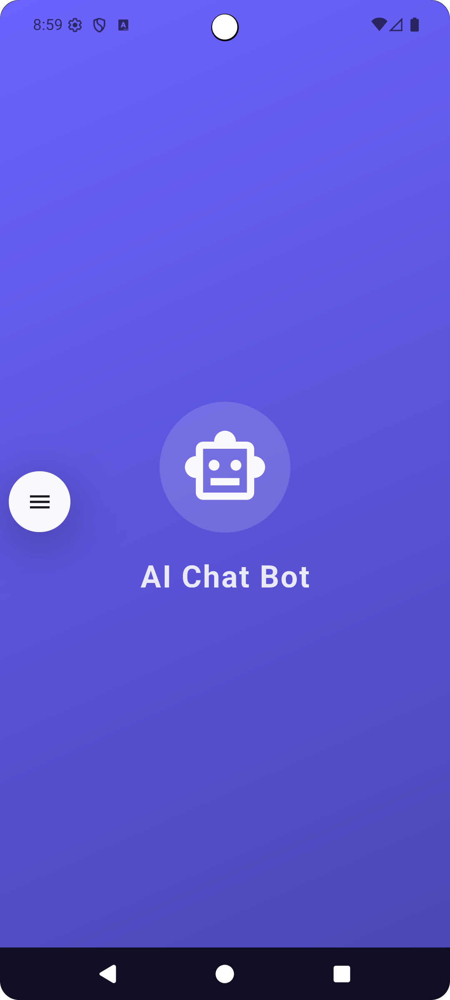
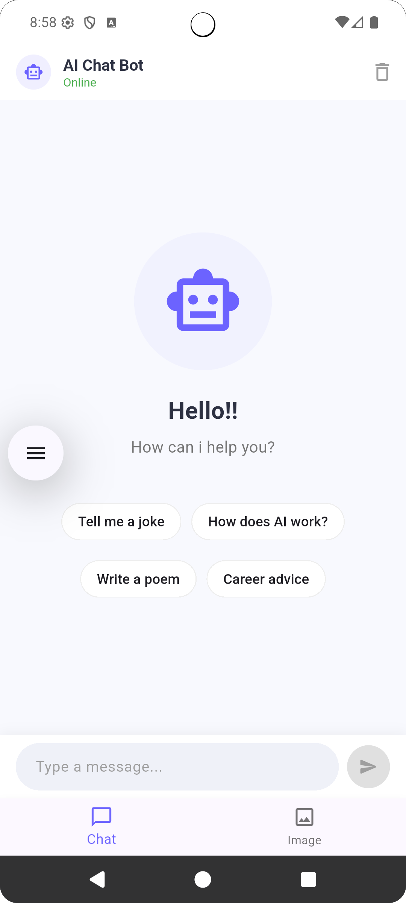
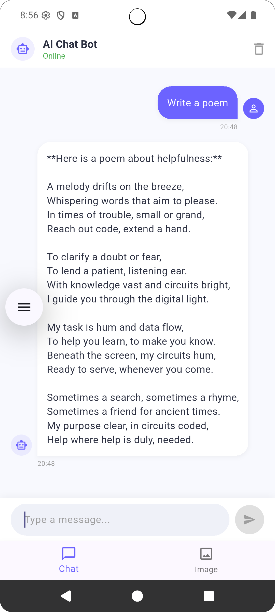
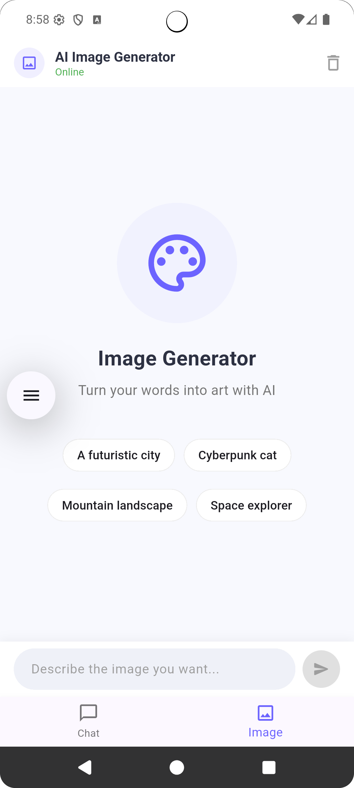

# 🤖 Sweet LLM-based AI Chatbot

Welcome to **SweetTalk AI**, a large language model-powered chatbot designed to make conversations feel natural, engaging, and helpful.  
It can:
- 💬 Chat like a friend, with warmth and clarity
- 📚 Answer questions with deep knowledge
- 🎨 Adapt tone and style to your needs
- ⚡ Assist with tasks, from writing to brainstorming

Here’s what it looks like in action:

---

### 🌟 Why SweetTalk AI?
Because conversations should feel human, not robotic.  
This chatbot blends **creativity, empathy, and intelligence** to support you in learning, working, and exploring ideas.
